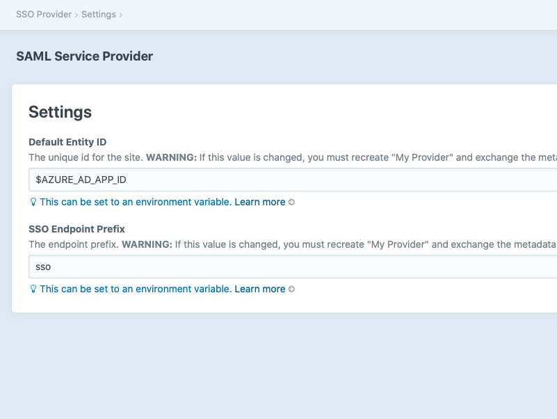

## Azure AD

::: tip Notice
All IdPs work a little differently. The plugin doesn't know the ins and outs of each IdP. The plugin's 
goal is to work with the SAML specification, the best it can.
:::

Azure AD expects the Service Provider's Entity ID to match the "Application ID" on the Azure AD side. 

#### Creating "My Provider" with the Correct Application ID
You can find the Azure AD Application ID here:  

Once you have this ID, goto the "Craft CMS admin > SAML SP Plugin Settings" and change the "Default Entity ID" 
field to that Application ID value. You can use an environmental variable like shown below.

Once this is set create "My Provider" in the saml plugin and the Entity ID will be set appropriately. If one already exists,
delete that one and recreate it so the Metadata XML is appropriately created.

#### Info Needed by Azure AD
These steps assume you don't have access to managing the Azure AD instance. If you are the person managing this instance,
follow the necessary steps based on Azure AD's instructions. All of these items can be found within "My Provider" in the 
Craft CMS SAML SP Plugin.

1. Certificate - Download the certificate and share this with the contact managing the Azure AD instance.

2. ACS - Share the Assertion Consumer Service/ACS/callback

3. Single Logout/SLO Endpoint

#### Basic Mapping
Azure AD uses standard claims for user attributes. Here is a basic mapping configuration:
- Last Name: `http://schemas.xmlsoap.org/ws/2005/05/identity/claims/surname`
- First Name: `http://schemas.xmlsoap.org/ws/2005/05/identity/claims/givenname`
- Email Address: `http://schemas.xmlsoap.org/ws/2005/05/identity/claims/emailaddress`

The mapping within the plugin looks like this:

